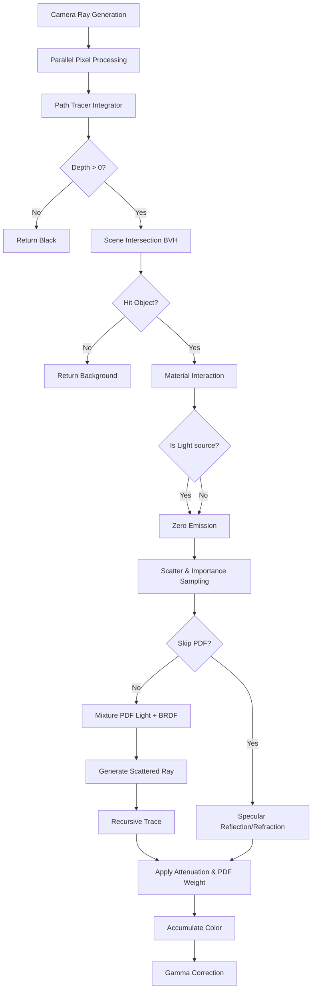
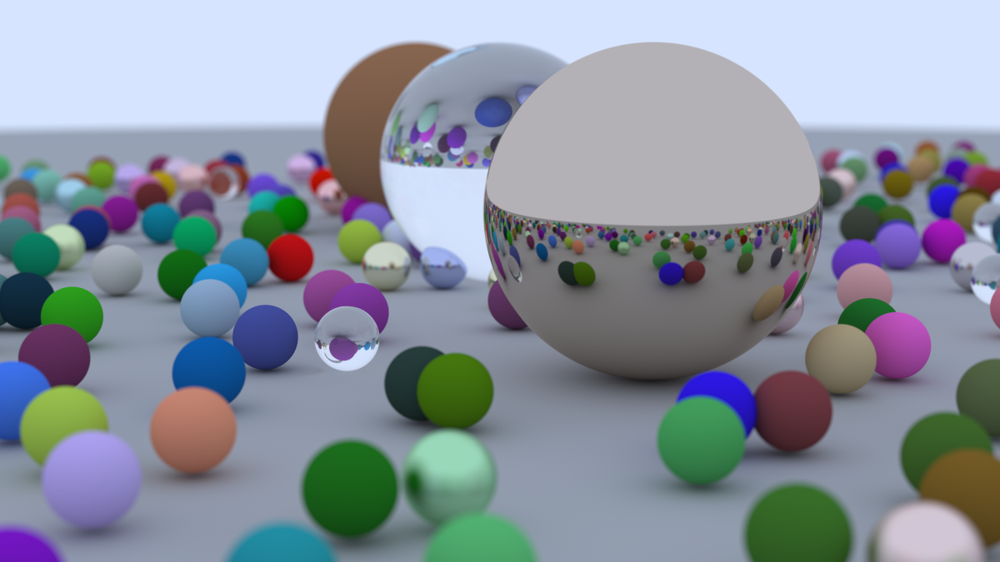
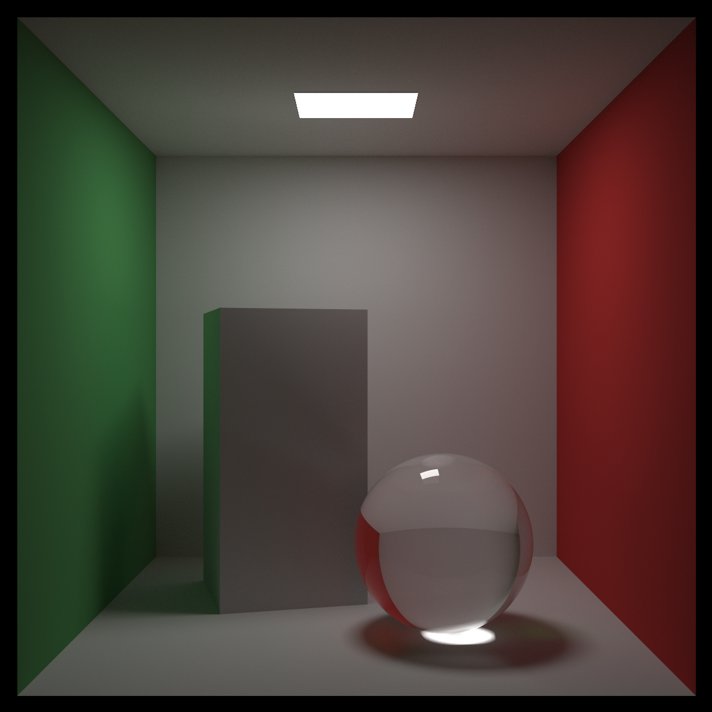
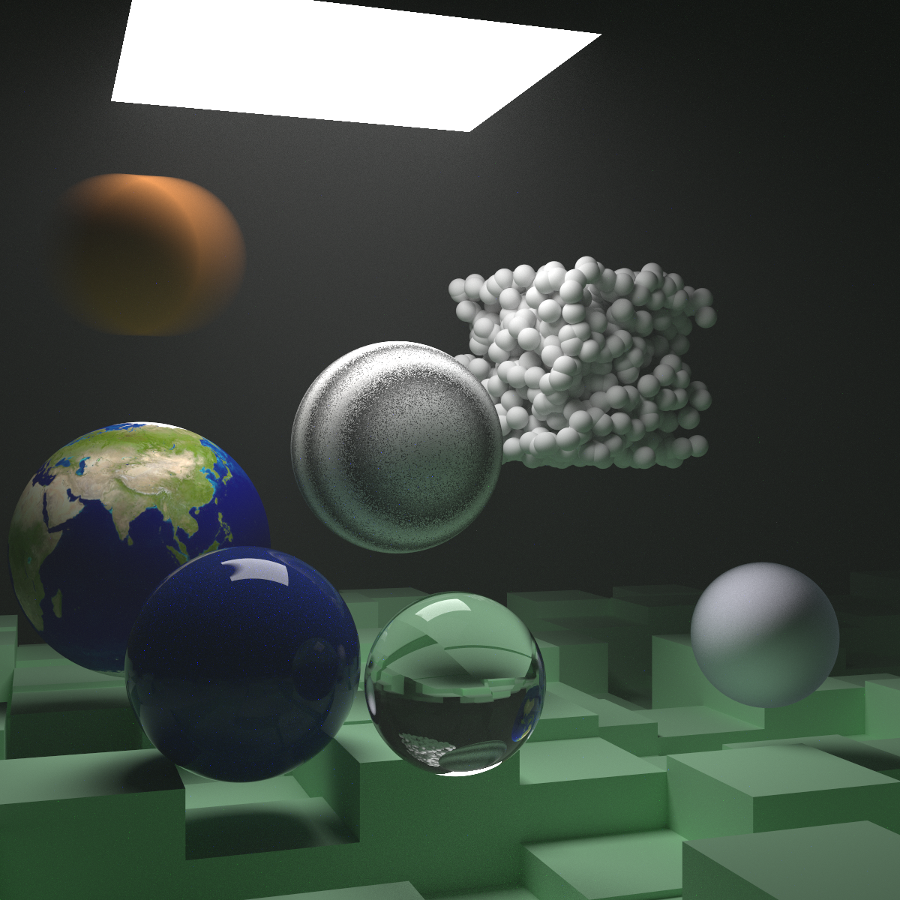

# Ray Tracing: The Rest of Your Life - Rust Implementation

A modern, high-performance Rust implementation of advanced ray tracing techniques based on the "Ray Tracing in One Weekend" book series. This project has been architecturally refactored to separate core logic, geometry, integration, and material systems, focusing on Monte Carlo methods, importance sampling, and parallel rendering.

## Features

- **Monte Carlo Path Tracing**: Physically based global illumination using the `PathTracer` integrator.
- **Importance Sampling**: Variance reduction using PDF (Probability Density Functions) to sample light sources and BRDFs.
- **Advanced Materials**: Dielectrics (glass), Metals, Lambertian (diffuse), Diffuse Lights, and Isotropic volumes.
- **Volume Rendering**: Support for constant mediums (fog/smoke) and sub-surface scattering simulation.
- **BVH Acceleration**: Bounding Volume Hierarchies for O(log n) intersection performance.
- **Procedural Textures**: Perlin noise, turbulence, image mapping, and checkerboard patterns.
- **Parallel Computing**: Multi-threaded rendering pipeline utilizing `Rayon`.
- **Robust Architecture**: Modular design with distinct `Integrator`, `Material`, `PDF`, and `Texture` traits.

## Project Structure

The project has been refactored into modular components for better maintainability and extensibility:

```
src/
├── core/           # Basic math, rays, camera, intervals, and interactions
│   ├── camera.rs
│   ├── interaction.rs
│   ├── ray.rs
│   └── vec3.rs
├── geometry/       # Geometric primitives and acceleration structures
│   ├── bvh.rs
│   ├── quad.rs
│   ├── sphere.rs
│   └── hittable.rs
├── integrators/    # Rendering algorithms (Path Tracing)
│   ├── path_tracer.rs
│   └── integrator_trait.rs
├── materials/      # Surface properties and scattering logic
│   ├── lambertian.rs
│   ├── metal.rs
│   └── dielectric.rs
├── sampling/       # Monte Carlo sampling and Probability Density Functions
│   ├── pdf.rs
│   └── random.rs
├── scenes/         # Scene definitions (Cornell Box, Final Scene, etc.)
├── textures/       # 2D and 3D textures (Image, Noise, Solid)
└── main.rs         # Entry point and scene selector
```

## Rendering Pipeline

The rendering process follows a stochastic path tracing approach:



## The Mathematics of Rendering

Understanding the relationship between the physical rendering equation and the specific implementation in this project is crucial.

### 1. The Standard Rendering Equation

The standard rendering equation describes the outgoing radiance $L_o$ from a point $p$:

$$ L_o(p, \omega_o) = L_e(p, \omega_o) + \int_{\Omega} f_r(p, \omega_i, \omega_o) \, L_i(p, \omega_i) \, (\omega_i \cdot n) \, d\omega_i $$

To solve this integral using Monte Carlo estimation, we obtain the estimator:
$$ \text{Color} = \text{Emission} + \frac{f_r(\omega_i, \omega_o) \cdot L_i(\omega_i) \cdot \cos\theta}{p(\omega_i)} $$

### 2. The Implementation Equivalence

In path_tracer.rs, you will see this calculation:

```rust
emission + srec.attenuation * sample_color * scattering_pdf / pdf_val
```

This implementation splits the standard BRDF term ($f_r \cdot \cos\theta$) into two distinct components. The mathematical equivalence is:

$$ \underbrace{\text{Attenuation} \times \text{Scattering PDF}}_{\text{Code Implementation}} \equiv \underbrace{f_r(\omega_i, \omega_o) \times \cos\theta}_{\text{Standard Physics}} $$

**Example: Lambertian (Diffuse) Material**

- **Standard Physics**: $f_r = \frac{A}{\pi}$, so the numerator term is $\frac{A}{\pi} \cos\theta$.
- **Code Implementation**:
  - `attenuation` = $A$ (Albedo/Color)
  - `scattering_pdf` = $\frac{\cos\theta}{\pi}$
  - Product: $A \times \frac{\cos\theta}{\pi}$

### 3. Why this decomposition?

This specific split, popularized by Peter Shirley's book series, offers two significant advantages:

1. **Intuitive Decoupling (Energy vs. Geometry)**:
    It separates **"How much energy reflects?"** (`attenuation`/color) from **"Where does it reflect to?"** (`scattering_pdf`/shape). This makes implementing new materials more intuitive—you define the surface color and the geometric scattering shape separately.

2. **Simplifying Importance Sampling**:
    If we use a sampling strategy $p(\omega_i)$ that perfectly matches the material's physical scattering (Perfect Importance Sampling), then `pdf_val` becomes mathematically identical to `scattering_pdf`.

    The equation simplifies beautifully:
    $$ \text{Color} = \text{Attenuation} \cdot L_i \cdot \frac{\text{Scattering PDF}}{\text{Sampling PDF}} \Rightarrow \text{Attenuation} \cdot L_i $$

    This makes the code logic clear: If we sample exactly where the material wants to scatter, the reflected color is simply the incident light multiplied by the material's albedo.

## Render Gallery

### 1. Random Spheres (Book 1 Final)

A classic scene demonstrating motion blur, depth of field, and basic material types (Metal, Dielectric, Lambertian).


### 2. Cornell Box with Glass Sphere (Book 3)

A physically based lighting test featuring area lights, soft shadows, color bleeding, and caustics via glass refraction.


### 3. The Final Scene (Book 2 Final)

A complex scene combining all features: Perlin noise, image textures, volumetric fog, subsurface scattering, and thousands of motion-blurred spheres.


## Key Code Implementation

### The Path Tracer (`li` function)

The core integrator loop handles emission, material scattering, and importance sampling.

```rust
// src/integrators/path_tracer.rs
fn li(&self, ray: &Ray, depth: u32, world: &dyn Hittable, lights: Option<&Arc<dyn Hittable>>, background: &Color) -> Color {
    if depth == 0 { return Color::zeros(); }

    // 1. Intersect Ray with World
    let mut isect = Interaction::default();
    if !world.hit(ray, Interval::new(0.001, f64::INFINITY), &mut isect) {
        return *background;
    }

    let material = isect.material.as_ref().unwrap();
    let emission = material.emitted(ray, &isect, isect.uv.0, isect.uv.1, &isect.p);

    // 2. Scatter Ray
    let mut srec = ScatterRecord::default();
    if !material.scatter(ray, &isect, &mut srec) {
        return emission;
    }

    // 3. Specular optimization (Glass/Metal don't need PDF)
    if srec.skip_pdf {
        return emission + srec.attenuation.component_mul(
            &self.li(&srec.skip_pdf_ray, depth - 1, world, lights, background)
        );
    }

    // 4. Importance Sampling (Mixture PDF: Light + Material)
    let p: Arc<dyn PDF> = if let Some(light_objects) = lights {
        let light_pdf = Arc::new(HittablePDF::new(light_objects.clone(), isect.p));
        let mat_pdf = srec.pdf_ptr.unwrap();
        Arc::new(MixturePDF::new(light_pdf, mat_pdf))
    } else {
        srec.pdf_ptr.unwrap()
    };

    // 5. Monte Carlo Integration
    let scattered_direction = p.generate();
    let scattered_ray = Ray::new(isect.p, scattered_direction, ray.time);
    let pdf_val = p.value(&scattered_direction);

    if pdf_val < 1e-5 { return emission; }

    let scattering_pdf = material.scattering_pdf(ray, &isect, &scattered_ray);
    let sample_color = self.li(&scattered_ray, depth - 1, world, lights, background);

    emission + srec.attenuation.component_mul(&sample_color) * scattering_pdf / pdf_val
}
```

### Probability Density Functions

The system mixes sampling strategies (e.g., 50% chance to sample light, 50% chance to sample BRDF) to reduce noise.

```rust
// src/sampling/pdf.rs
impl PDF for MixturePDF {
    fn value(&self, direction: &Vec3) -> f64 {
        0.5 * self.p[0].value(direction) + 0.5 * self.p[1].value(direction)
    }

    fn generate(&self) -> Vec3 {
        if random_double() < 0.5 {
            self.p[0].generate()
        } else {
            self.p[1].generate()
        }
    }
}
```

## Quick Start

### Requirements

- Rust 1.70+
- Cargo

### Usage

The project is built to allow switching between scenes via command-line arguments.

```bash
# Build in release mode (essential for performance)
cargo build --release

# Run Book 1 Scene (Random Spheres)
cargo run --release -- many_balls

# Run Book 3 Scene (Cornell Box)
cargo run --release -- cornell_box

# Run Book 2 Scene (Complex Final)
cargo run --release -- final_scene
```

## Performance Benchmarks

Performance metrics on an 8-core CPU. The refactored architecture maintains the performance characteristics of the original logic while improving code safety and modularity.

| Scene | Resolution | Samples (SPP) | Render Time |
|-------|------------|---------------|-------------|
| Cornell Box | 600×600 | 1000 | ~5 minutes |
| Final Scene | 800×800 | 5000 | ~45 minutes |
| Many Balls | 1200×675 | 500 | ~30 seconds |

16-core example:

```bash
Loading Book 2 Final Scene...
Rendering 1200x1200 image with 10000 SPP...
  [04:30:02] [########################################] 1440000/1440000 (0s)                                           Render complete in 16202.70s
Image saved to final_scene.png

Loading Book 3 Cornell Box (Glass Sphere)...
Rendering 1200x1200 image with 10000 SPP...
  [02:44:19] [########################################] 1440000/1440000 (0s)                                           Render complete in 9859.83s
Image saved to cornell_box.png

Loading Book 1 Final Scene (Random Spheres)...
Rendering 1200x675 image with 10000 SPP...
  [01:34:36] [########################################] 810000/810000 (0s)                                             Render complete in 5676.01s
Image saved to many_balls.png
```

## References

- [Ray Tracing in One Weekend](https://raytracing.github.io/books/RayTracingInOneWeekend.html)
- [Ray Tracing: The Next Week](https://raytracing.github.io/books/RayTracingTheNextWeek.html)
- [Ray Tracing: The Rest of Your Life](https://raytracing.github.io/books/RayTracingTheRestOfYourLife.html)
- [Physically Based Rendering](http://www.pbr-book.org/)

## License

MIT License
